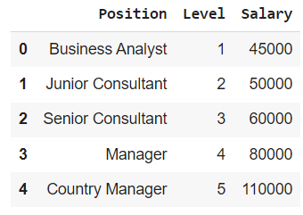
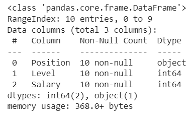
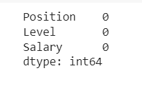
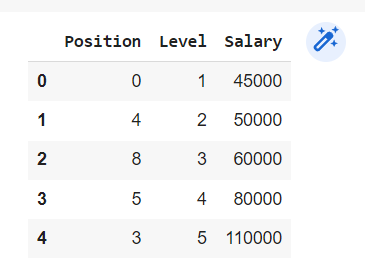
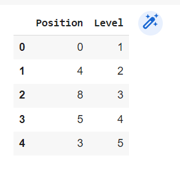
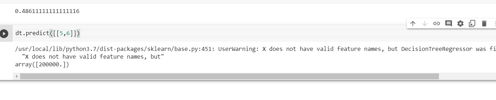

# Implementation-of-Decision-Tree-Regressor-Model-for-Predicting-the-Salary-of-the-Employee

## AIM:
To write a program to implement the Decision Tree Regressor Model for Predicting the Salary of the Employee.

## Equipments Required:
1. Hardware – PCs
2. Anaconda – Python 3.7 Installation / Jupyter notebook

## Algorithm
1.Import the required libraries .
2.Read the data frame using pandas.
3.Get the information regarding the null values present in the dataframe.
4.Apply label encoder to the non-numerical column inoreder to convert into numerical values.
5.Determine training and test data set.
6.Apply decision tree regression on to the dataframe.
7.Get the values of Mean square error, r2 and data prediction.

## Program:

Program to implement the Decision Tree Regressor Model for Predicting the Salary of the Employee.

Developed by: K.Jhansi

RegisterNumber:  212221230045

```
import pandas as pd
data=pd.read_csv("Salary.csv")
data.head()
data.info()
data.isnull().sum()
from sklearn.preprocessing import LabelEncoder
le=LabelEncoder()
data["Position"]=le.fit_transform(data["Position"])
data.head()
x=data[["Position","Level"]]
x.head()
y=data[["Salary"]]
from sklearn.model_selection import train_test_split
x_train, x_test, y_train, y_test=train_test_split(x,y,test_size=0.2,random_state=2)
from sklearn.tree import DecisionTreeRegressor
dt=DecisionTreeRegressor()
dt.fit(x_train,y_train)
y_pred=dt.predict(x_test)
from sklearn import metrics
mse=metrics.mean_squared_error(y_test, y_pred)
mse
r2=metrics.r2_score(y_test,y_pred)
r2
dt.predict([[5,6]])
```

## Output:








## Result:
Thus the program to implement the Decision Tree Regressor Model for Predicting the Salary of the Employee is written and verified using python programming.
